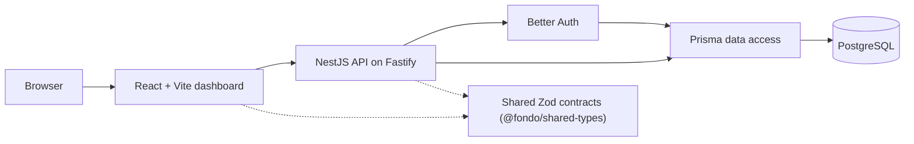

# Fondo

[](https://www.typescriptlang.org/)
[](https://react.dev/)
[](https://vite.dev/)
[](https://nestjs.com/)
[](https://fastify.dev/)
[](https://www.prisma.io/)
[](https://www.postgresql.org/)
[](https://turbo.build/repo)
[](https://pnpm.io/)

> A TypeScript monorepo for personal finance tracking and an extensible catalog of independently enabled services.

## Overview

Fondo is a full-stack personal finance platform built as a production-minded TypeScript monorepo. It combines a tenant-aware backend, a modern React dashboard, and a shared contract layer designed so that new financial services can be added without entangling the core ledger.

The project focuses on the engineering foundations that keep a SaaS product maintainable as it grows: explicit tenant boundaries, session-based authentication, shared validation contracts, an intentional money representation, a centralized design system, and automated quality checks.

### Key Features

- 🏢 **Personal tenant provisioning:** Every signup automatically creates a personal tenant with an `ADMIN` membership and default user settings, atomically.
- 🔐 **Session-based authentication:** Email/password sign-up, sign-in and sign-out with Better Auth, HttpOnly cookies and optional GitHub and Google OAuth.
- 📊 **Financial dashboard:** Balance, income, expenses, savings and budgets presented with an instrument-panel visual language.
- 📈 **Reports:** Cash flow and category spending charts with period selection and export affordances.
- 🛠️ **Service catalog:** A visual catalog where Personal Finance is enabled and Vehicle, Home, Insurance and Entrepreneurship are presented as coming extensions.
- 🌎 **Localized experience:** English and Spanish translations with persisted language preferences.
- 🌓 **Theme preferences:** Light, dark and system color schemes persisted locally and synchronized with the profile.
- 💱 **Money-safe display:** A canonical USD ledger stored in integer minor units, with USD/EUR display conversion through a typed exchange-rate provider.
- ✅ **Automated quality:** Shared linting, typechecking, testing and builds orchestrated by Turborepo.

> [!NOTE]
> The repository is under active development. Authentication, personal tenant provisioning, settings and the service catalog are implemented. The dashboard and reports currently render typed mock data — replacing mocks with real API queries, accounts and categories, the transaction ledger and production hardening are part of the roadmap.

## Current Status

| Area                               | Status                                                     |
| ---------------------------------- | ---------------------------------------------------------- |
| Monorepo foundation                | Stable                                                     |
| Authentication and personal tenant | Stabilized                                                 |
| Settings and preferences           | Partially connected to the API                             |
| Dashboard and reports              | Functional UI on typed mock data                           |
| Service catalog                    | Visual catalog with Personal Finance enabled               |
| Testing                            | Vitest configured; UI and integration coverage in progress |
| CI/CD and release pipeline         | Not yet configured                                         |

For a detailed, itemized inventory of known gaps and planned work, see [`docs/technical-debt.md`](docs/technical-debt.md).

## Architecture

### Monorepo Structure

```text
fondo/
├── apps/
│   ├── api/                    # NestJS API on Fastify, vertical feature modules
│   └── web/                    # React + Vite dashboard application
├── packages/
│   ├── config/                 # Shared TypeScript and ESLint configuration
│   ├── db/                     # Prisma schema, migrations and database client
│   ├── i18n/                   # Shared locale types and formatting constants
│   ├── shared-types/           # Shared Zod schemas and TypeScript contracts
│   └── ui/                     # Reusable Mantine-based design system
├── docs/
│   ├── architecture.md         # System boundaries and planned modules
│   ├── api-conventions.md      # API conventions and error contract
│   ├── design-system.md        # Design tokens and shared components
│   ├── decisions/              # Architecture decision records (ADRs)
│   └── technical-debt.md       # Itemized inventory of planned and known debt
├── docker-compose.yml          # Local PostgreSQL and Mailpit services
├── pnpm-workspace.yaml         # Workspace packages and dependency catalog
└── turbo.json                  # Task pipeline and caching configuration
```

### System Flow



The API resolves the authenticated user and its personal tenant at the request boundary. The `SessionAuthGuard` enforces session validity before any domain module receives a tenant context, and repositories require that context for every query. Shared Zod schemas provide a single validation contract between the web app and the API.

> [!NOTE]
> Tenant isolation is enforced in the application layer. PostgreSQL row-level security is planned as defense in depth before financial endpoints are released — see [ADR 0004](docs/decisions/0004-tenant-isolation.md).

### Technical Decisions

| Decision                 | Rationale                                                                                                                                                                                                 |
| ------------------------ | --------------------------------------------------------------------------------------------------------------------------------------------------------------------------------------------------------- |
| **NestJS on Fastify**    | Provides explicit modules, dependency injection, guards and request pipelines with Fastify's performance and lower overhead. See [ADR 0001](docs/decisions/0001-nestjs-over-express.md).                  |
| **React + Vite**         | A fast, type-safe frontend development loop with a small production bundle.                                                                                                                               |
| **Mantine UI**           | Accessible, composable primitives with a centralized design system in `packages/ui`.                                                                                                                      |
| **TanStack Query**       | A scalable foundation for server-state caching, invalidation and request lifecycle management.                                                                                                            |
| **Prisma**               | Declarative schema management, generated types and reviewable migrations behind `packages/db`. See [ADR 0002](docs/decisions/0002-prisma-over-drizzle.md).                                                |
| **Integer minor units**  | Monetary values are stored as signed integers in a canonical USD ledger, avoiding floating-point errors while allowing USD/EUR presentation. See [ADR 0003](docs/decisions/0003-money-representation.md). |
| **Shared Zod contracts** | Runtime validation stays aligned with TypeScript types across the web app and the API.                                                                                                                    |
| **pnpm + Turborepo**     | Workspace-level dependency reuse with a dependency-aware task pipeline and caching.                                                                                                                       |

For a deeper look at boundaries and planned modules, see [`docs/architecture.md`](docs/architecture.md).

## Technology Stack

| Area                 | Technologies                                                                                               |
| -------------------- | ---------------------------------------------------------------------------------------------------------- |
| **Frontend**         | React 19, Vite 7, TypeScript, Mantine UI, TanStack Query, React Router, Recharts, i18next, react-hook-form |
| **Backend**          | NestJS 11, Fastify 5, Better Auth, Zod, nestjs-zod, Swagger, Throttler, Helmet                             |
| **Database**         | PostgreSQL 17, Prisma 6                                                                                    |
| **Auth**             | Better Auth with email/password, optional GitHub and Google OAuth, HttpOnly session cookies                |
| **Shared packages**  | `@fondo/config`, `@fondo/db`, `@fondo/i18n`, `@fondo/shared-types`, `@fondo/ui`                            |
| **DevOps & Tooling** | pnpm workspaces, Turborepo, Docker, Docker Compose, ESLint, Prettier, Vitest                               |

## Getting Started

### Prerequisites

- Node.js 24 or later
- pnpm 11.5.1 or later
- Docker and Docker Compose
- Git

### Installation

1. Clone the repository and enter the project directory:

   ```bash
   git clone https://github.com/arturopt25/fondo.git
   cd fondo
   ```

2. Enable Corepack and install workspace dependencies:

   ```bash
   corepack enable
   pnpm install
   ```

3. Create the environment files:

   ```bash
   cp .env.example .env
   cp apps/api/.env.example apps/api/.env
   cp apps/web/.env.example apps/web/.env
   ```

4. Review the values in the `.env` files. At minimum, configure a 32-character `BETTER_AUTH_SECRET` in `apps/api/.env`. OAuth credentials are optional for the current local flows.

5. Start PostgreSQL and Mailpit with Docker Compose:

   ```bash
   docker compose up -d postgres mailpit
   ```

6. Generate the Prisma client and apply local migrations:

   ```bash
   pnpm --filter @fondo/db db:generate
   pnpm --filter @fondo/db db:migrate
   ```

7. Start the frontend and API in development mode:

   ```bash
   pnpm dev
   ```

The web application is available at `http://localhost:5173`, the API health endpoint at `http://localhost:3000/api/v1/health`, the Swagger UI at `http://localhost:3000/api/v1/docs`, and the Mailpit web UI at `http://localhost:8025`.

> [!TIP]
> PostgreSQL is exposed on host port `5433` (mapped to the internal `5432`) to avoid conflicts with other local PostgreSQL instances. Use `pnpm --filter @fondo/db db:studio` to inspect the local database through Prisma Studio.

### Environment Variables

| File            | Variable                                            | Purpose                                                                              |
| --------------- | --------------------------------------------------- | ------------------------------------------------------------------------------------ |
| `.env`          | `POSTGRES_DB`, `POSTGRES_USER`, `POSTGRES_PASSWORD` | Docker Compose credentials for PostgreSQL                                            |
| `.env`          | `DATABASE_URL`                                      | Prisma connection string for the local database                                      |
| `.env`          | `WEB_ORIGIN`                                        | Allowed frontend origin (defaults to `http://localhost:5173`)                        |
| `apps/api/.env` | `NODE_ENV`                                          | Runtime environment                                                                  |
| `apps/api/.env` | `PORT`                                              | API listen port (defaults to `3000`)                                                 |
| `apps/api/.env` | `BETTER_AUTH_SECRET`                                | Session and authentication secret (min 32 characters)                                |
| `apps/api/.env` | `BETTER_AUTH_URL`                                   | Public API base URL used by Better Auth (e.g. `http://localhost:3000`)               |
| `apps/api/.env` | `GITHUB_CLIENT_ID`, `GITHUB_CLIENT_SECRET`          | Optional GitHub OAuth credentials                                                    |
| `apps/api/.env` | `GOOGLE_CLIENT_ID`, `GOOGLE_CLIENT_SECRET`          | Optional Google OAuth credentials                                                    |
| `apps/web/.env` | `VITE_API_URL`                                      | API base URL used by the frontend                                                    |
| `apps/web/.env` | `VITE_AUTH_URL`                                     | Better Auth base URL used by the frontend (e.g. `http://localhost:3000/api/v1/auth`) |

> [!NOTE]
> `BETTER_AUTH_URL` is the API origin (auth is mounted on the `/api/v1/auth` base path server-side), while `VITE_AUTH_URL` points the web client at the full auth path.

## Code Quality and Testing

All root-level quality commands are routed through Turborepo:

```bash
pnpm lint             # Run ESLint across workspaces
pnpm typecheck        # Validate TypeScript across workspaces
pnpm test             # Run unit and component tests
pnpm build            # Build all applications and packages
pnpm format:check     # Verify Prettier formatting
```

The API, web app and shared packages each expose their own `lint`, `typecheck`, `test` and `build` scripts, so quality gates can also run per workspace (for example, `pnpm --filter @fondo/api test`).

> [!NOTE]
> Automated coverage is still maturing. Component tests under jsdom and end-to-end auth integration tests are tracked in [`docs/technical-debt.md`](docs/technical-debt.md), along with isolating test fixtures from the local database.

## Architecture Evolution

The current implementation establishes the auth and tenant core, the shared contract layer and the product shell. The opportunities below describe how the platform could evolve as usage, data volume and service coverage increase. They are intentionally framed as architectural capabilities rather than a fixed feature checklist.

### Reliable Financial Core

- **Accounts and categories:** Introduce tenant-scoped financial accounts and a seeded category catalog with per-tenant customization.
- **Transaction ledger:** Model income, expenses and atomic transfers with double-entry bookkeeping, preventing double booking and negative balances.
- **Auditability:** Add audited edit/delete of financial records and audit logging for account and category mutations.

### Connected Personal Finance

- **API-driven screens:** Replace the typed mocks behind the dashboard and reports with repository/query adapters connected to TanStack Query.
- **Functional reports:** Implement financial dashboards, category spending, cash flow and budgets-versus-actual over real data.
- **Rate-aware conversion:** Use a validated exchange-rate provider, applying the latest rate to current balances and effective rates to historical reports.

### Configurable Services

- **Service entitlements:** Introduce a service catalog with per-tenant subscriptions and a `ServiceAccessGuard` for route-level enforcement.
- **Permissions:** Add `ADMIN` / `MEMBER` permission semantics and service-aware navigation.
- **Future service ecosystem:** Vehicle, Home, Insurance and Entrepreneurship as later product contracts on top of the same foundation.

### Security and Isolation

- **PostgreSQL row-level security:** Add RLS as defense in depth for financial data, with cross-tenant isolation tests.
- **Endpoint-level protections:** Per-endpoint rate limiting, payload size limits and a production CORS review.
- **Effective auth hardening:** Case-insensitive uniqueness, safe error surfaces and concurrent provisioning guarantees are already in place; end-to-end coverage continues to grow.

### Production Readiness

- **Health and observability:** Real PostgreSQL health checks, structured metrics, tracing and centralized error monitoring.
- **Delivery pipeline:** A CI/CD pipeline with quality gates, container publishing and database migration controls.
- **Quality gates:** E2E suites for auth, workspace isolation and critical user workflows, plus dependency audits and accessibility reviews.

## Documentation

- [`docs/architecture.md`](docs/architecture.md) — system boundaries and planned modules
- [`docs/api-conventions.md`](docs/api-conventions.md) — API conventions and error contract
- [`docs/design-system.md`](docs/design-system.md) — design tokens and shared components
- [`docs/decisions/`](docs/decisions/) — architecture decision records
- [`docs/technical-debt.md`](docs/technical-debt.md) — itemized inventory of planned and known debt
